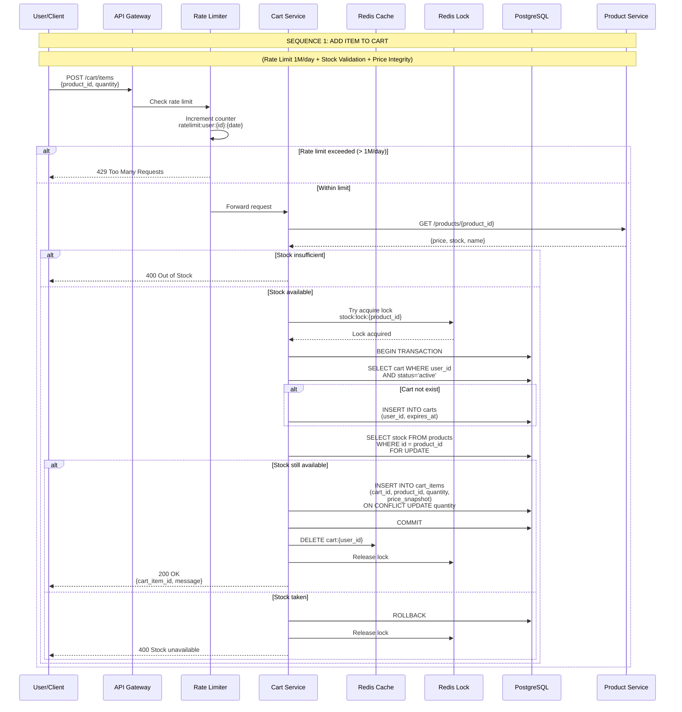
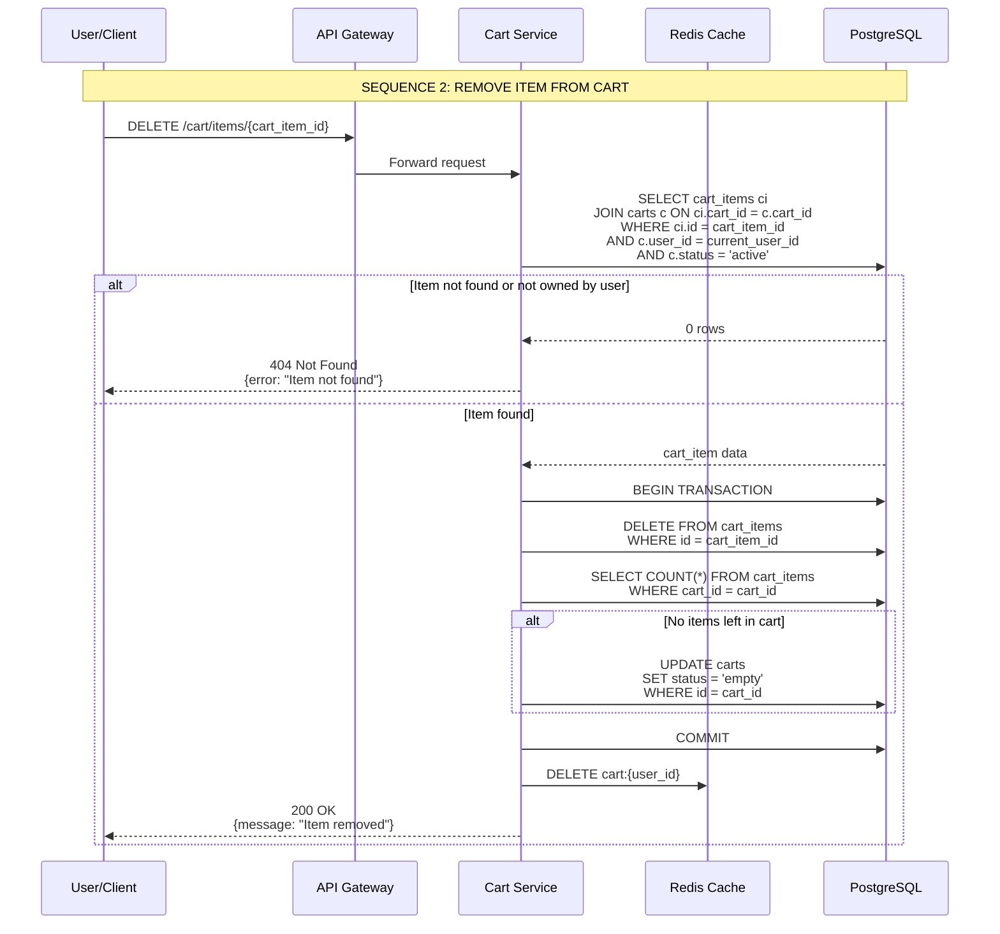
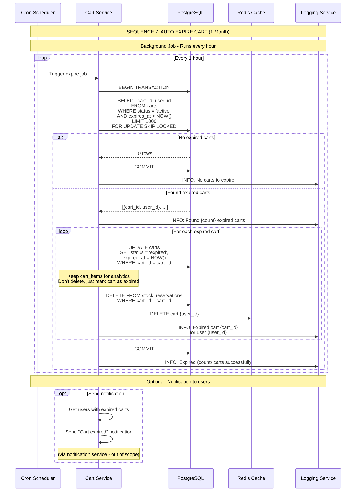

# System Design Cart

Cart:

- Add item
    - Limit until out of stock
- Remove Item
- Update qty
- Remove cart / checkout
- Consistent / multi device (across sessions) per account
    - Phone A (clothes merk A 9)
    - Phone B (clothes merk A 9)
- Race condition(only 1 cart can be checkout)
- 1 day 1 mio add to cart
- Expire 1 month
- Data integrity
    - No price manipulation
    - Parameter tampering
- Detail how checkout work
    - Make sure stock available

## Sequence Diagram

### ADD ITEM

### REMOVE ITEM FROM CART

### AUTO EXPIRE CART

